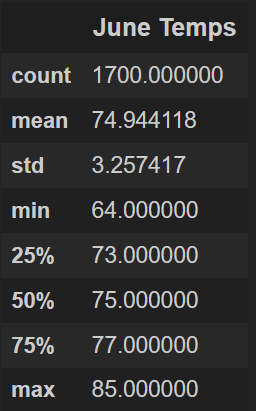
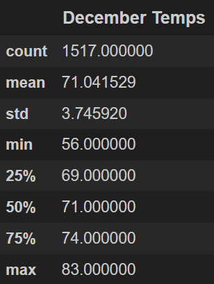

# surfs_up
Data Analytics Boot Camp - Module 9

---

## Overview of the analysis
The purpose of this analysis is to get more insights on the weather conditions in ***June*** and ***December*** in ***Oahu***. This information will play a major role in determining if the surf and ice cream shop business is sustainable year-round.

## Results
Based on the analysis, below are three major differences between ***June*** and ***December's*** temperatures:
 1. ***June*** had **12%** more temperature observations than ***December***
 2. ***June’s*** average temperature is almost **4** degrees higher than ***December’s***
 3. The minimum temperature in ***December*** can get to **8** degrees cooler than ***June***

## Summary
In summary, we can confidently conclude that both months have good average temperatures indicating that the surf and ice cream shop business should get visitors year around. 

Other queries I would use are to get the average precipitation for both months. Please see below:

**Average Precipitation in June**

`june_prec = session.query( Measurement.prcp ).filter( func.strftime("%m", Measurement.date) == '06' )`

**Average Precipitation in December**

`dec_prec = session.query( Measurement.prcp ).filter( func.strftime("%m", Measurement.date) == '12' )`

---

